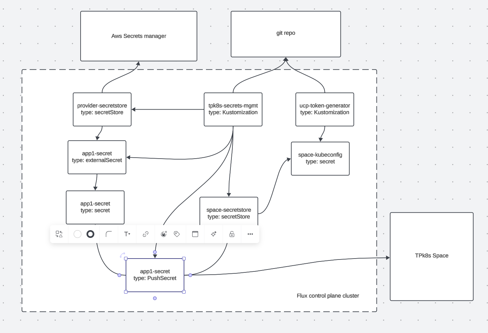

# Secrets Mgmt

This example shows how to setup TPK8s with flux for secrets mgmt. The core use case here is to utilize [ESO](https://external-secrets.io/) to fetch secrets from an external provider and then sync them into a Tanzu Platform Space. Combing ESO with Flux allows for managing `externalSecrets` objects in git along with the `pushSecret` to be able to define all secrets needed for a space along side and app that is being deployed to that space. This uses the already existing kubeconfig secrets that are generated as part of the base flux and tpk8s config to also sync secrets.


# Structure

`bootstrap` - contains the initial boostrap resources, this sets up the kustomization to sync all of the resources
`flux-resources` -  this is what the boostrap targets, this sets up the needed k8s resources to handle secret sying.

# Architecture




# Setup

If you have not already followed [the setup in the main Readme](../README.md#setup), do that now.


1. this sample uses AWS Secrets manager, you will need to create a secret with the correct auth for this to work. otherwsie you can edit the secretStore to use a different provider. to change the provider edit `flux-resources/provider-secretstore.yml`

2. apply the base flux kustomization, if you already have a full gitops setup you do not need to run this manually and can add it to your existing repo. This bootstrap will create a kustomization that will bootstrap the entire process. 

```bash
kubectl apply -k bootstrap
```